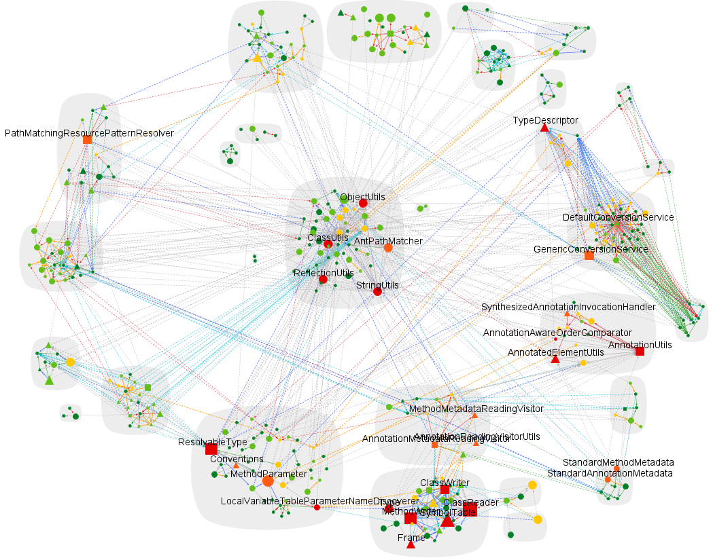

# CodeMR Spring Framework Analysis Project
Spring Framework is the foundation for all [Spring projects](https://spring.io/projects). Collectively the Spring Framework and the family of Spring projects is often referred to simply as "Spring".
Spring provides everything required beyond the Java programming language for creating enterprise applications for a wide range of scenarios and architectures.

## Spring Framework README

Please see [Spring Framework README](README-Spring-Framework.md) in the root directory of the project.

CodeMR Report
=================

You can download or clone the project to use the existing extracted model and graphs.
You can create your graphs, your working sets and analyse the project based on the extracted model without limitation.
You can download CodeMR plugins for your favorite IDE from:
- [CodeMR for IntelliJ](https://plugins.jetbrains.com/plugin/10811-codemr)
- [CodeMR for Eclipse](https://marketplace.eclipse.org/content/codemr-software-quality-tool)

See CodeMR [web site](https://www.codemr.co.uk) for details on the CodeMR.
You can download [trial license](https://www.codemr.co.uk/downloads) to try CodeMR for other projects.

Analysis for Spring v5.1.2.RELEASE

CodeMR model path: ./codemr/spring-framework/spring-framework.mdl

### Snapshots ###

#### Overview #### 

#### Complexity in Sunburst View #### 

#### Coupling in Package Structure View #### 

#### Complexity in Treemap View #### 

#### Package Dependency  View #### 

#### Outline View #### 

#### Graph of Spring Core Module #### 

#### Inheritance Graph of Spring Core Module #### 

#### Inheritance Graph of Spring Context Module #### 

